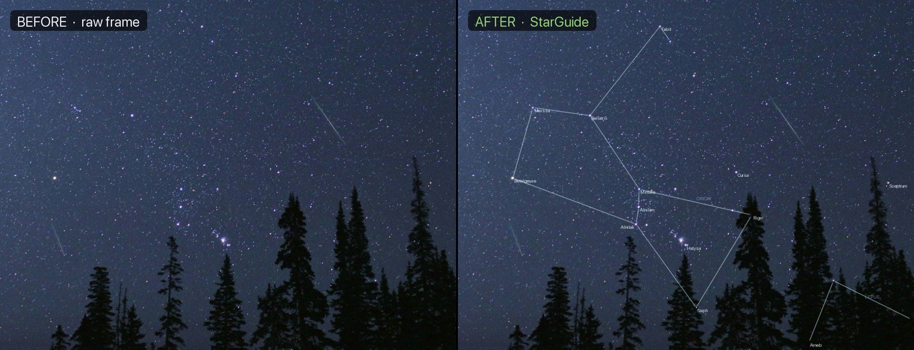
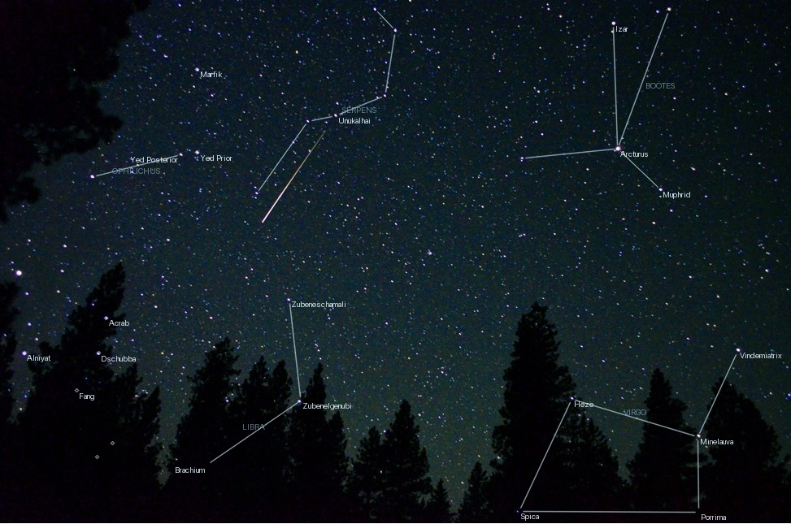
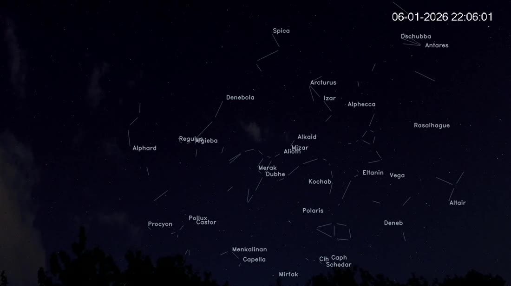

# StarGuide

**Realtime, calibration-free star identification.** Point it at a night-sky
photo or video and it tells you *which star is which* — labelling individual
stars, constellations, and (given a date) planets, with **no manual calibration,
no plate from elsewhere, no click-to-align**.



It is the identification counterpart to the rest of SkyStream: a detector says
*"something is up there"*; StarGuide says *"that one is Betelgeuse, and that row
of three is Orion's Belt."*

---

## What it does

One entry point, four use cases:

| Use case | Input | How it solves | Needs |
|----------|-------|---------------|-------|
| **Still photo** | any one-off image | blind quad-hash plate solve from the star pattern | nothing |
| **Video clip** | short / handheld clip | mean-stacks frames, then blind-solves | nothing |
| **Live camera** | a tripod-fixed clip/feed | recovers the pole from sidereal star *motion* | camera location |
| **Stream overlay** | a file or `rtsp://` feed | solves periodically, draws labels on the intact video | nothing |

```python
from starguide import identify, overlay_stream, SiteConfig

identify("some_photo.jpg")                        # still photo — blind solve
identify("phone_clip.mov")                         # short/handheld clip — auto
identify("allsky.mp4",                             # fixed camera — motion solve
         SiteConfig(lat=40.19, lon=-76.33, utc_offset_h=4))
overlay_stream("rtsp://cam/stream", "out.mp4")     # label a live feed, video intact
```

Every solve is **self-validating**: a result is returned only when the brightest
catalog stars actually land on real detected stars, *decisively above chance*.
When the sky isn't recognizable (too few stars, a deep-sky close-up, an extreme
fisheye it can't lock), it **declines** rather than inventing an answer.

<p align="center">
  
  
</p>

---

## Install

```bash
pip install -r requirements.txt        # numpy, scipy, opencv-python, astropy, Pillow
# or, as a package:
pip install -e .
```

Python ≥ 3.10. A **25,713-star catalog (to magnitude 7.5), 450 proper star names,
and all 88 IAU constellation figures** are bundled in `starguide/data/` — no
network, no API key. (Sources and licenses: [`starguide/data/README.md`](starguide/data/README.md);
regenerate with `python tools/build_catalog.py`.)

---

## Quick start

```bash
# Identify the bundled sample photos -> examples/image/output/*.jpg
python examples/image/identify_image.py

# Motion-solve the bundled fixed-camera clip and overlay labels ON the video
python examples/video/identify_video.py            # -> examples/video/output/*.mp4

# Overlay any clip or rtsp:// feed without a known site (the general path)
python examples/video/identify_video.py rtsp://CAM/stream --stream
```

See [`examples/`](examples/) — two self-contained use cases (`image/`, `video/`),
each with `input/`, a pre-computed `output/`, and a runnable script.

### Python API

```python
from starguide import identify, solve_image, BlindConfig
from datetime import datetime, timezone

# A still photo, saving an annotated overlay
sky = identify("photo.jpg", mode="image", save="out.png")
print(sky.solution.n_inliers, "stars,", sky.solution.rms, "px RMS")
for star, x, y in sky.matches:
    ...   # star.name, star.hip, pixel (x, y)

# Name planets too — give a UTC capture time (and optionally a site for the Moon)
when = datetime(2018, 6, 16, 5, 44, 58, tzinfo=timezone.utc)
sky = solve_image("photo.jpg", BlindConfig(planets=True), when=when)
print([p[0] for p in sky.planets if p[4]])     # e.g. ['Jupiter', 'Mars', 'Saturn']
```

### CLI

```bash
python identify.py photo.jpg --image --out labelled.png --style auto
python identify.py clip.mp4  --when 2018-06-16T05:44:58   # enable planets
```

---

## Naming planets

Planets move, so they aren't in the star catalog — give a **date** and StarGuide
projects them through the solved model (Astropy ephemerides). It only marks a
planet that is genuinely there: above the horizon (when a site is given), inside
the field, and sitting on a real bright object. A bright planet (Jupiter, Venus)
is trusted by its brightness; a faint one only where the plate model is locally
well-constrained. Nothing is drawn as a guess.

It also runs **in reverse** — `when_from_planets(sky)` dates a photo from where a
bright planet sits, good to within weeks near opposition.

---

## Controlling the overlay — verbosity & labels

How much gets drawn is a single dial, `verbosity` (0 → 1): **0 draws nothing, 1
shows and labels every star down to the catalog limit**, and in between it sets a
magnitude cut for what's drawn. Which stars earn a *name* is `label_mode`:

- **`importance`** (default) — the brightest stars (the ones that matter most),
  tracking the same cut as the dots.
- **`visibility`** — the stars that show most strongly in *this* frame (by SNR) —
  useful when the brightest stars are behind cloud.
- **`none`** — lines and dots, no names.

```python
from starguide import identify

identify("photo.jpg", mode="image", save="out.png",
         style={"verbosity": 1.0, "label_mode": "visibility"})
```

```bash
python identify.py photo.jpg --image --verbosity 0.4 --label-mode importance
```

For full control, pass an `OverlayStyle` (every line, dot, colour and font is a
field) — `OverlayStyle.pro(shape, verbosity=…, label_mode=…)`.

---

## How it works (the short version)

- **A still photo** is identified the astrometry.net way: the catalog is indexed
  as **quad hashes** (4-star shapes invariant to rotation/scale/translation); the
  image's quads are looked up; each match seeds a pose that is grown and a lens
  model fit.
- **The lens model adapts to the field.** Narrow rectilinear photos use a
  gnomonic/polynomial model; **wide fisheyes** (>100°) use a physical
  `a1·ρ + a3·ρ³ + a5·ρ⁵` camera model, because a polynomial *folds* at a
  fisheye's edge. This is what lets one solver handle a phone snapshot and a
  180° all-sky frame alike.
- **A fixed-camera video** needs no quad search at all: the stars rigidly rotate
  about the celestial pole at the sidereal rate, so a linear fit to their drift
  recovers the **pole pixel for free**, with no catalog — then the plate solve is
  anchored there. Advancing the clock is a single rotation of the catalog, so
  overlaying frames is realtime.
- **Honesty is enforced**, not assumed: a solve is accepted only if the bright
  stars land on real detections *far above the random hit-rate* for that image's
  detection density — the guard that makes it decline rather than hallucinate.

The full derivation — pole recovery, the quad code, the equidistant plane, the
fisheye growth, the trust gate, planets, and a module map — is in
**[docs/HOW_IT_WORKS.md](docs/HOW_IT_WORKS.md)**.

---

## Scope — what solves, what declines

StarGuide is built to be **right or silent**, never confidently wrong.

**Solves well:** ordinary star photos (Orion, Boötes, Scorpius…), wide all-sky
fisheye frames with a decent star field, and fixed-camera clips with real
sidereal drift. On a cloudy reference all-sky clip the motion solver puts ~87% of
catalog stars (to mag 4.5) on a real star at ~1px RMS.

**Declines honestly:** deep-sky close-ups with no constellation pattern, hazy or
nearly-starless frames, very low-resolution wide fisheyes (sub-pixel stars), and
the most extreme >150° fisheyes where no clean quad seed survives the distortion.
Declining is the designed behavior, not a failure — the tests assert both
*correct identification* and *honest refusal*.

---

## Testing

```bash
pytest -q          # deterministic, no network
```

The suite covers geometry, detection, the motion solve (synthetic + real-clip),
blind solving (synthetic gnomonic **and** synthetic fisheye recovery, plus
random-field rejection), planets (forward and reverse), and the video / stream
paths. Tests needing a large sample file skip themselves when it's absent, so the
suite is green on a fresh clone and exercises the real data when you add it.

---

## Porting to your own camera / codebase

Everything camera-specific lives in `starguide/config.py`. To point StarGuide at
a different fixed camera you touch only a `SiteConfig` (where it is) and
optionally a `SolveConfig` (how hard to work); nothing else hardcodes a location,
path, or frame count. For one-off photos and stream overlay there's nothing to
configure. The package is self-contained (catalogs bundled, no `../`
dependencies) — drop the `starguide/` directory into another project and import it.

---

## Project layout

```text
starguide/             the package (module map in docs/HOW_IT_WORKS.md)
  data/                bundled Hipparcos catalog + constellation lines
examples/
  image/               input/ photos, pre-computed output/, identify_image.py
  video/               input/ clip, pre-computed output/, identify_video.py
docs/HOW_IT_WORKS.md   the in-depth design guide
tests/                 deterministic pytest suite
identify.py            command-line entry point
```

## License

MIT — see [LICENSE](LICENSE).
